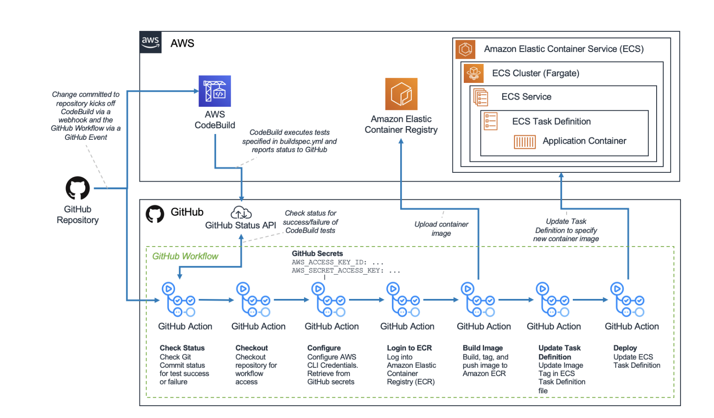
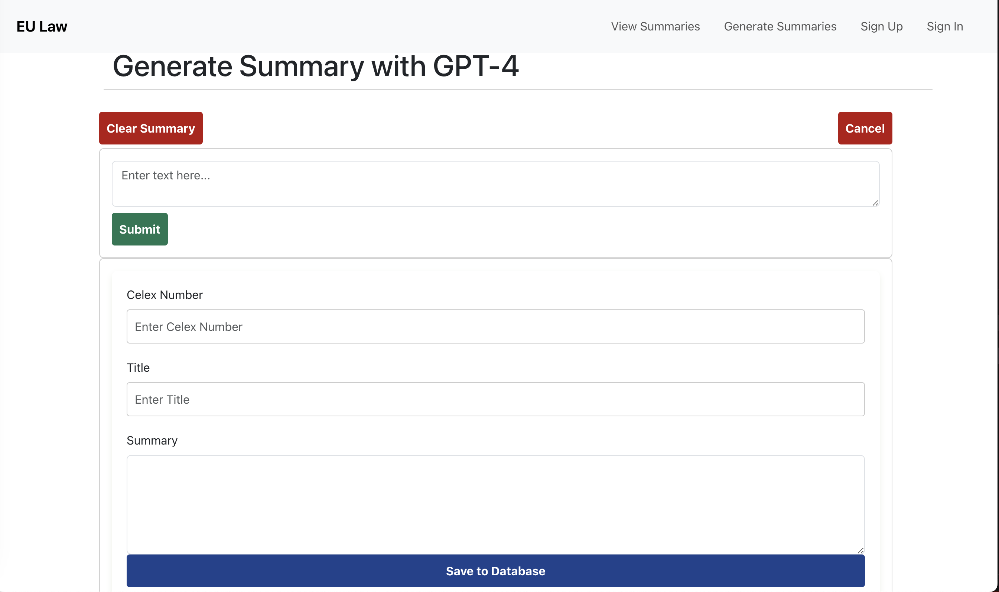

# EU-Law-Summary-Platform: Seamless Human-AI Workflow Management"
"Bridging GenAI and Human Verification for Smarter Workflows."


# Getting Started
### Folder Structure
```
EU-LAW-SUMMARY-PLATFORM/
|
├── .github/  # GitHub specific configurations
│   └── workflows/  # GitHub Actions workflows
│       ├── ci.yml  # Continuous integration workflow
│       └── cd.yml  # Continuous deployment/delivery workflow
│
├── docker-compose.yml  # Docker compose file to orchestrate containers
│
├── frontend/  # React frontend
│   ├── Dockerfile
│   ├── package.json
│   ├── src/
│   │   ├── components/  # React components
│   │   ├── pages/  # React pages
│   │   ├── app.js
│   │   └── index.js
│   └── public/
│       └── index.html
│
├── backend/  # Django backend
│   ├── Dockerfile
│   ├── manage.py
│   ├── requirements.txt
│   ├── backend/  # Django project folder
│   │   ├── settings.py
│   │   ├── urls.py
|   |   |-- wsgi.py
│   │   └── asgi.py
│   └── accounts/  # Django app folder
│       ├── migrations/
│       ├── models.py
│       ├── views.py        #log in/out, document api logic
│       └── serializers.py  #create new user logic
│
├── llm-model/  # Large Language Model (e.g., OpenAI API integration)
│   ├── Dockerfile
│   ├── model.py  # Integration with OpenAI's API
│   └── requirements.txt
│
├── llm-preprocessing/  # Data preprocessing, if any
|   ├── Dockerfile
|   ├── script.py  # Preprocessing scripts
|   └── requirements.txt
|
|__ secrets/
    └-- store secrets & env locally inside secrets folder at root level (DO NOT CHECK INTO GITHUB)

```


### Loading the frontend
1. cd into the frontend folder
2. run the following command to install project dependencies
```npm install```
3. after dependencies are installed, use the following command to start the front end dev server:
```npm run start```


### Loading the backend
1. cd into the backend folder
2. run the following to install backend dependencies
```pip install -r requirements.txt```
3. start the backend server with the following command:
```python3 manage.py runserver```
4. Once server is loaded, test the api calls at the following link: http://127.0.0.1:8000/swagger/

### Creating a PR
Example: create a PR against main
Scenario: I am working on a ticket Backend > fix project that needs to fix a bug on main.

Steps:
ensure that local main is up to date with remote main.
create and checkout a new local branch called 'Backend-fix-project' from main.
set local branch name as you see fit. Backend-fix-project is just an example.
commit your code change to Backend-fix-project.
when you are ready to publish your code change and request review, make a PR by
pushing your local branch 'Backend-fix-project' to github and set it to track remote 'origin/Backend-fix-project'.
make sure that main is selected as the base branch, and that the head branch is Backend-fix-project.

```
//assume there's a local 'main' branch that tracks remote main, and
git checkout main
git checkout -b Backend-fix-project
//code stuff
git add .
git commit -m "your commit message"
git push -u origin Backend-fix-project // -u sets remote upstream tracking; pushes local Backend-fix-project to remote `origin`.
```

### Loading the entire app - docker-compose file
The `docker-compose.yml` file helps the user to deploy both the frontend and backend with a single command. To get started, make sure to install Docker on your system, and have it running. Afterwards:

To run docker containers, run the following command:
```shell
docker-compose up
```
To remove docker containers, run the following command:
```shell
docker-compose down
```
If new changes are not being reflected while coding, manually force a rebuild with the following command:
```shell
docker-compose up --build
```


### Github Action workflow
Our GitHub repository consists of 1 frontend application and 1 backend application and the Github Action CI/CD pipeline is to build two container images, upload the container images to ECR, and update an ECS Task Definition for every commit and pull requests to the GitHub repository.

This architecture (except the AWS CodeBuild) represents a complete CI/CD pipeline that uses a GitHub workflow to automatically coordinate building, testing, and deploying an application to ECS for every commit to the repository.




### How to interact with AI on local environment (Temporary: Will remove/update later)
1. Get a openAI key and export to environment variable
Run this in the terminal
```bash
export OPENAI_API_KEY="sk-"
```
In the same terminal, start the python backend app
2. Start the front end app in a second terminal

3. Go to the endpoint http://localhost:3000/generate_new_summary

4. Example prompt to enter:
```bash
Write a summary for Regulation (EU) 2021/2115 of the European Parliament and of the Council of 2 December 2021 establishing rules on support for strategic plans to be drawn up by Member States under the common agricultural policy (CAP Strategic Plans) and financed by the European Agricultural Guarantee Fund (EAGF) and by the European Agricultural Fund for Rural Development (EAFRD) and repealing Regulations (EU) No 1305/2013 and (EU) No 1307/2013 
In this format:
1. Summary 
2. WHAT IS THE AIM OF THE REGULATION?
3. KEY POINTS
4. FROM WHEN DOES THE REGULATION APPLY?
5. MAIN DOCUMENT
6. RELATED DOCUMENTS
```
5. After few seconds, output will show:




