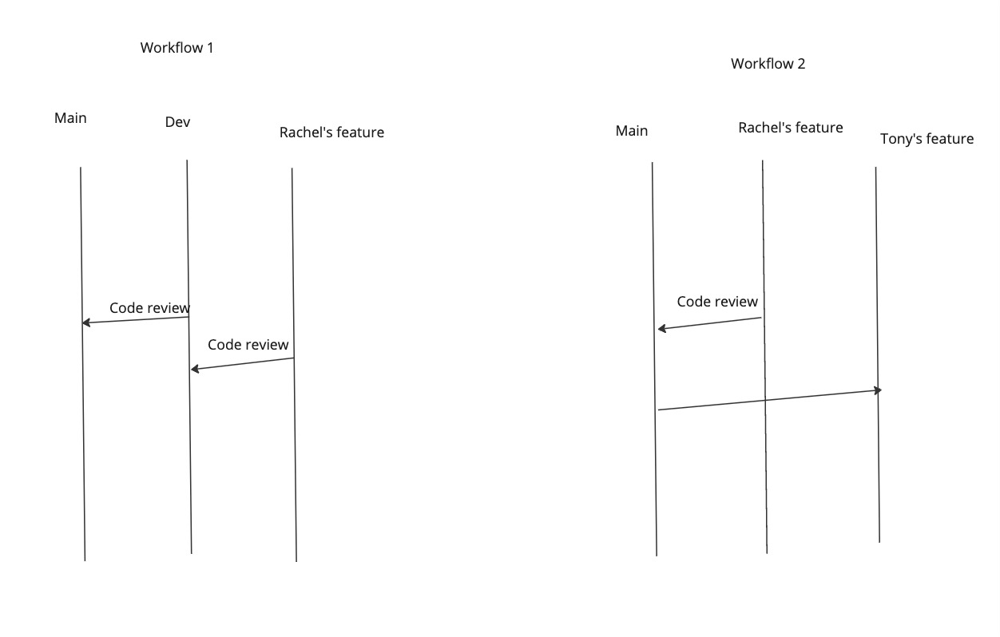

## Team git flow
#### Best practice: 
- Code review before merge code to main

1. create git branch
2. add code to the branch
3. create pull request 
4. wait for people's code review, if no one has reviewed yet on your branch, send reminder on slack
5. after code review has been approved, then merge the code to main

We will follow the workflow2 for the project is 6-8 weeks long, the workflow 1 is at enterprise scale and takes more time for maintenance

### Scenario 1:
If Tony's waiting for what Rachel's work on her branch
- solution1: Rachel can do pull request on incomplete feature code and merge to main for Tony to use
- solution2: Tony can work on her branch, even if the feature for Tony is login/logon vs Rachel's work is summarization UI

Both solutions work

