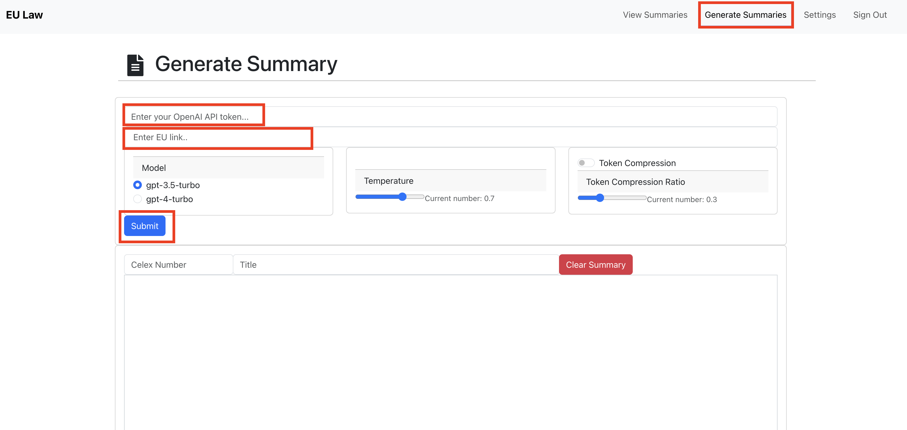
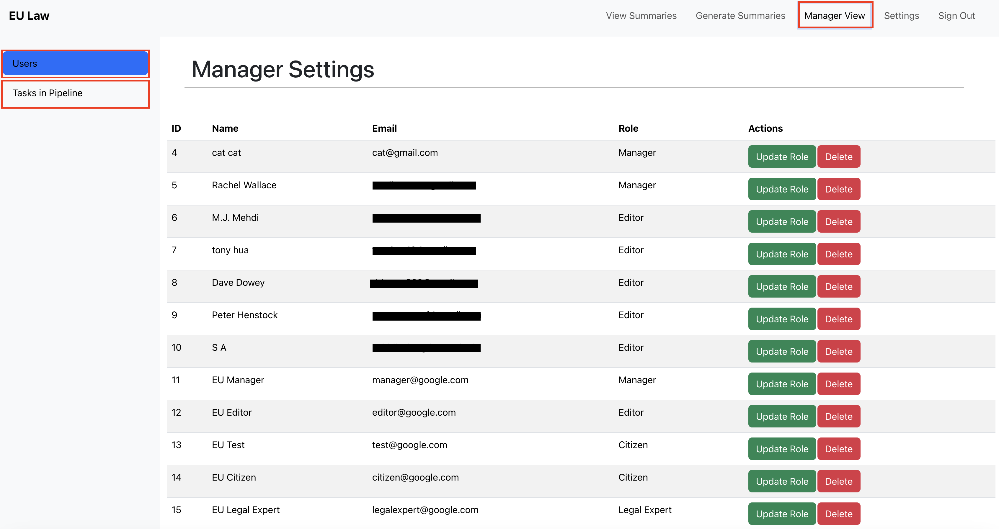

## Table of Contents

1. [Loading the App](#loading-the-entire-app-using-docker-compose-file)
    - [Loading the entire app using docker-compose file](#loading-the-entire-app-using-docker-compose-file)
    - [Loading the frontend](#loading-the-frontend)
    - [Loading the backend](#loading-the-backend)
    - [Creating a PR](#creating-a-pr)
2. [User Manual](#user-manual)
    - [Citizen User and All User Sign Up](#citizen-user-and-all-user-sign-up)
    - [Editor User](#editor-user)
    - [Legal Expert User](#legal-expert-user)
    - [Manager User](#manager-user)

### Loading the entire app using docker-compose file
The `docker-compose.yml` file helps the user to deploy both the frontend and backend with a single command. To get started, make sure to install Docker on your system, and have it running. Afterwards:

To run docker containers, run the following command:
```shell
docker-compose up
```
To remove docker containers, run the following command:
```shell
docker-compose down
```
If new changes are not being reflected while coding, manually force a rebuild with the following command:
```shell
docker-compose up --build
```

### Loading the frontend
1. cd into the frontend folder
2. run the following command to install project dependencies
```npm install```
3. after dependencies are installed, use the following command to start the front end dev server:
```npm run start```


### Loading the backend
1. cd into the backend folder
2. run the following to install backend dependencies
```pip install -r requirements.txt```
3. start the backend server with the following command:
```python3 manage.py runserver```
4. Once server is loaded, test the api calls at the following link: http://127.0.0.1:8000/swagger/

### Creating a PR
Example: create a PR against main
Scenario: I am working on a ticket Backend > fix project that needs to fix a bug on main.

Steps:
ensure that local main is up to date with remote main.
create and checkout a new local branch called 'Backend-fix-project' from main.
set local branch name as you see fit. Backend-fix-project is just an example.
commit your code change to Backend-fix-project.
when you are ready to publish your code change and request review, make a PR by
pushing your local branch 'Backend-fix-project' to github and set it to track remote 'origin/Backend-fix-project'.
make sure that main is selected as the base branch, and that the head branch is Backend-fix-project.

```
//assume there's a local 'main' branch that tracks remote main, and
git checkout main
git checkout -b Backend-fix-project
//code stuff
git add .
git commit -m "your commit message"
git push -u origin Backend-fix-project // -u sets remote upstream tracking; pushes local Backend-fix-project to remote `origin`.
```


# User Manual

These are the instructions to navigate through the application as a user with the role of Citizen, Editor, Legal Expert, or Manager. Each section includes the high level features that are specific to that user.

## Citizen User and All User Sign Up

Each Citizen can Sign up through the application and create an account with Email, First Name, Last Name, and a Password. In addition to the citizen, each user Editor, Legal Expert and Manager will also need to follow the sign up and sign in process to access their account.


On Sign in, a citizen user has access to view each summary and sort by category if necessary.


## Editor User

Viewing a summary gives the editor access to edit and then save a document. Once the document is saved they will need to “send for review” which gives the legal expert access to add in revision notes. The timeline view gives the editor the ability to view the version comparisons after each edit.


For the steps to generate a new summary, the editor will need to enter their OpenAi API token on the first summary along with the EU Link. The token compression settings are all available for the user to adjust the LLM model, temperature and compression ratio. On submit, the user will see the celex number and title auto-populate and they will be able to save the new summary to the database.



## Legal Expert User

Once viewing a summary, the legal expert can request for revision to provide notes for the current summary version. This will be attached to that version in the timeline. Once no more revisions are necessary the legal expert will need to publish to end the editing workflow.


## Manager User

The manager has access to summaries and to generate a new summary. Their additional features allow them to update and delete user roles in the manager view. They can also force change the status of each summary document in the task pipeline simply by dragging the document to the specific status column.



